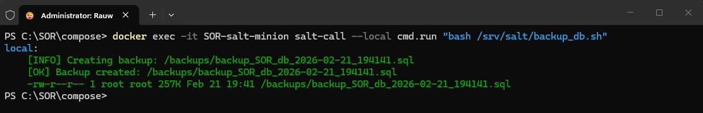
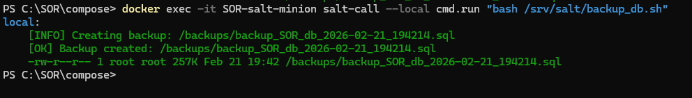

# SafeOnRoute
- El presente README.md actua como una presentación previa a la lectura de la documentación. Además, este README.md incluye capturas de pantalla del proceso para realizar este proyecto.

## Introduccion
- En este proyecto veremos el paso a paso para crear un sistema de ingesta, almacenamiento y respaldo de datos simulados con los microservicios de Apache Kafka y SaltStack. Además Docker Desktop ha sido el host de los containers donde todos se han alojado dichos servicios. Por último, PostgreSQL ha sido el sistema de bases de datos implementado bajo la UI de Adminer.

## Video de demostración
- Para demostrar que el proyecto efectivamente funciona se ha [realizado el siguiente video](https://youtu.be/FUB88QVhaw4) que afirma el funcionamiento del proyecto asi como su recreación paso a paso.

## Galería de Safe On Route
- 1er backup manual.

- 2do backup manual.

- Creacion del topic de Apache Kafka.

- Descripcion del topic de Apache Kafka.

- Video del funcionamiento producer-consumer siguiendo la ruta:
`assets/images/ProducerConsumerLocal.mp4`